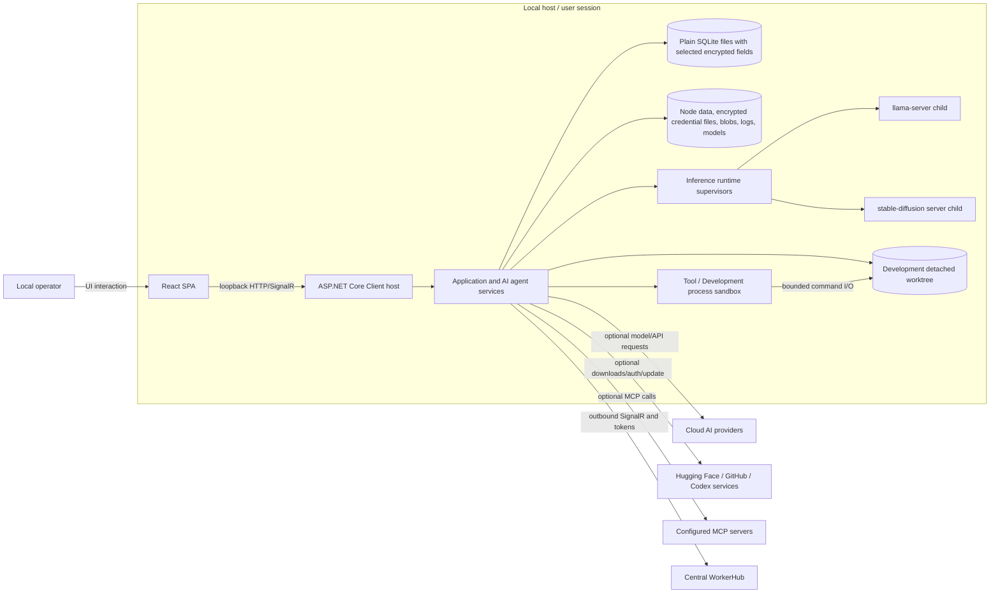

# 01 — System Context and Trust Boundaries

## Review boundary

| Item | Value |
|---|---|
| Frozen application baseline | `7e64ed589e14eecc0e522e807d2e531a1095d19a` |
| Review date | 2026-07-28 |
| Scope | Supported hosting modes, major runtime components, local and external interfaces, process and data boundaries, and security assumptions |
| Evidence boundary | Repository implementation, tests, configuration, and documentation. No deployed network capture, host inspection, identity-provider record, or runtime inventory was supplied. |

This chapter is a technical model, not an assurance statement. Source paths are internal traceability only.

## System purpose and deployment shape

XE Local AI Engine is a single-user, local-first application. Its principal deployable is an ASP.NET Core host (`XE-Local-AI-Engine.Client`) that exposes the local API and SignalR hubs, runs application services, opens the node data stores, and supervises local runtime processes. A React single-page application is the operator interface.

Two hosting shapes are material:

| Hosting shape | Runtime composition | Security interpretation |
|---|---|---|
| Packaged desktop / tester release | One local ASP.NET Core host serves the built React client and binds to a loopback address on an assigned port. Node data is rooted in a per-user directory. | Supported same-machine posture. The local HTTP endpoint relies on loopback binding, request-time local-origin checks, and application authentication rather than a network security appliance. |
| Aspire development orchestration | The development-only AppHost provisions the application project, a Vite development server, and a file-backed SQLite resource; it injects the operator-secret parameter and development configuration and exposes development URLs through Aspire orchestration. | Developer convenience boundary, not the shipped production topology. B1 commits a shared development-only parameter default; Aspire's sensitive flag does not make that value confidential or unique. The Vite server, AppHost dashboard/proxy behavior, and SQLite web tooling increase the development trust surface and are not evidence of a production control. |

The AppHost does not run a Docker HostAgent for inference or tool execution. Local inference and the live process-jail provider execute host child processes.

Internal traceability:

- `XE-Local-AI-Engine.Client/Program.cs`
- `XE-Local-AI-Engine.Client/ConfigureServices.cs`
- `XE-Local-AI-Engine.Client/Hosting/DesktopBootstrap.cs`
- `XE-Local-AI-Engine.Client/Hosting/DesktopLifecycle.cs`
- `XE-Local-AI-Engine.AppHost/AppHost.cs`

## System-context diagram

### Textual fallback for the diagram

1. A local operator uses the React interface.
2. The React client calls the ASP.NET Core host over loopback HTTP/HTTPS and SignalR.
3. The host routes requests into application and AI-agent services.
4. Application services persist identity and node state in local SQLite stores and persist other node files under the node data directory.
5. Local inference servers are separate host child processes owned by runtime-specific supervisors that provide readiness/liveness checks, retry/reaping, and tree-kill behavior. Their normal launchers do not use the process sandbox's environment-scrubbing or path-jail controls.
6. Tool and Development commands use the process sandbox's environment, path, timeout, output, and lifecycle controls, but still execute as the host user.
7. Development Mode creates an engine-owned detached Git worktree derived from an operator-registered repository; the worktree is workspace storage, not itself a child process.
8. Optional cloud model providers, model/update sources, MCP servers, and the central WorkerHub are outside the local-host trust boundary and receive traffic generated by their selected features, summarized in Chapter 02; no deployed network capture or complete egress inventory was supplied.

The diagram and fallback describe logical boundaries. They do not assert that a deployed host has no additional processes, interfaces, or routes.

## Major components and responsibilities

| Component | Security-relevant responsibility | Privilege/data boundary |
|---|---|---|
| React SPA | Holds the current access token in application memory, calls local APIs, receives SignalR events, and stores local diagnostic snapshots in browser IndexedDB | Browser origin and profile; refresh token is not exposed to JavaScript because it is an `HttpOnly` cookie |
| ASP.NET Core Client host | Local API and hubs, authentication/authorization, exception handling, health, service composition, logging, shutdown, and local child-process supervision | Runs with the launching user’s OS privileges and can access the node data directory and explicitly selected host resources |
| Application layer | Orchestrates chat, agents, credentials, cloud providers, MCP, Development Mode, scheduler, updates, persistence, and WorkerHub connection | Crosses local storage, child-process, and external-provider boundaries |
| AI agent layer | Model/tool orchestration, approval-aware tool execution, prompt and response handling | Model output is untrusted input; tool calls can cause local or external effects only through application-provided seams |
| Provider abstractions and implementations | Local llama.cpp/stable-diffusion runtimes and optional cloud/Codex/Hugging Face integrations | Provider choice determines whether prompt/content stays local or crosses an external boundary |
| Node SQLite persistence | Identity records, refresh-token hashes, conversations, jobs, agent state, metadata, and selected encrypted payload fields | Plain SQLite files; application-level encryption is selective rather than whole-file |
| Node file stores | Data Protection key ring, encrypted credentials, encrypted managed blobs, models/runtime assets, Development worktrees, logs, and local snapshots | Same host-user filesystem. Protection varies by asset; not every file is encrypted |
| Inference runtime supervisors | Start and monitor `llama-server` and `sd-server` host child processes; perform readiness/liveness checks, bounded retry/reaping, and tree-kill teardown | Same host user and network; normal model-server launchers inherit the host process environment and do not use the process sandbox's path-jail controls |
| Process sandbox runtime provider | Starts tool and Development child commands with a scrubbed environment, working-directory jail, path/symlink checks, timeout, output caps, and tree-kill | Supervision and application-level confinement only; no OS, network, CPU, memory, or PID isolation |
| Central WorkerHub | Optional outbound worker registration, token refresh, job assignment, and event exchange | External service boundary authenticated with locally protected worker credentials |

## Trust-boundary register

| ID | Boundary | Data/control crossing | Implemented controls | Material limitation |
|---|---|---|---|---|
| TB-01 | Operator/browser ↔ React application | User input, access token in memory, diagnostic state | Same-origin application; refresh cookie `HttpOnly`; client clears access token on logout/auth failure | Browser extensions, local malware, or a compromised user session remain outside application control |
| TB-02 | React ↔ local API and hubs | Credentials, prompts, files, results, administration actions, streaming events | Loopback bind guard; loopback peer and `Host`/`Origin` middleware; JWT authentication and role policy; request limits | Supported only for same-machine use; a same-host proxy or deliberate non-loopback override changes the threat model |
| TB-03 | Host ↔ identity/node SQLite | Password hashes, refresh-token hashes, application records, encrypted and plaintext columns | ASP.NET Core Identity; refresh rotation/revocation; AES-GCM on selected fields; migrations and a best-effort pre-migration snapshot | Plain SQLite structure and selected data remain readable; no SQLCipher/whole-file encryption |
| TB-04 | Host ↔ node data files | Credentials, Data Protection keys, blobs, models, logs, backups, runtime files | Purpose-separated Data Protection stores; owner-oriented file modes; AES-GCM managed blobs; data-root scoping | Host-user compromise can reach files and key material; backup/recovery and deletion are not comprehensively proven |
| TB-05a | Host ↔ local model-server children | Model prompts, generated output, model/runtime files, process output | Runtime-specific readiness/liveness checks, bounded retry and reaping, loopback runtime ports, tree-kill teardown | Children share the host user and network; normal launchers inherit the host process environment and do not receive process-sandbox jail controls |
| TB-05b | Host ↔ sandbox/tool/Development command children | Tool/build/test commands, workspace files, process output | Scrubbed environment, path/symlink guards, timeouts, byte/output caps, cancellation, tree-kill | Children share the host user and network; application path controls are not OS or resource isolation |
| TB-06 | Host ↔ optional external providers | Prompts, document/context content, provider metadata, credentials, model/download/update traffic | Explicit provider configuration; protected credential stores; provider-specific clients; Development cloud egress authorization seam | Third-party processing, retention, logging, jurisdiction, and availability are not controlled by this repository |
| TB-07 | Host ↔ MCP servers | Tool schemas, arguments, tool output, credentials or environment explicitly configured for a server | Registration/policy and application tool seams; approval records for approval-gated actions | An MCP server is a separate trust domain; tool output can be hostile and configured servers may create network or host effects |
| TB-08 | Registered repository ↔ managed Development worktree ↔ final apply | Source, Git metadata, build/test output, generated patch | Opaque selected-folder binding, canonical repository identity, detached worktree, protected-path checks, review/apply revalidation | Executed repository code runs as host user with host network; path/workflow controls are not a containment boundary |
| TB-09 | Host ↔ central WorkerHub | Worker identity, access/refresh tokens, assignments, status/events | Outbound connection; locally protected token store; refresh and revocation handling | External service availability and operating controls were not reviewed |
| TB-10 | AppHost/Vite development tooling ↔ application | Dev proxying, browser logs, health/docs URLs, SQLite web tooling | Development environment scoping and explicit orchestration wiring | Development convenience services enlarge local attack surface and must not be treated as the packaged deployment |

## Local API security boundary

Requests under `/api/local/v1` pass through `LocalApiSecurityMiddleware` before routing. The middleware requires:

- a loopback socket peer (or an in-process test/probe with no remote address);
- `Host` equal to `localhost`, `127.0.0.1`, or `::1`; and
- when `Origin` is present, a loopback origin whose scheme, host, and port match the request.

`LoopbackBindGuard` separately inspects the addresses Kestrel actually bound after startup and stops the application with an error exit code if a routable address is found, unless the explicit `Security:AllowNonLoopbackBind=true` opt-out is configured.

Authentication remains required for protected endpoints. First-run status, setup, login, and refresh are anonymous by design; setup/login/refresh are rate-limited, and setup uses a process-wide lock plus a serializable transaction to allow only the first completed administrator initialization.

Internal traceability:

- `XE-Local-AI-Engine.Client/Endpoints/Common/LocalApiSecurityMiddleware.cs`
- `XE-Local-AI-Engine.Client/Hosting/LoopbackBindGuard.cs`
- `XE-Local-AI-Engine.Client/Endpoints/Auth/V1/NodeAuthEndpoints.cs`
- `XE-Local-AI-Engine.Client.Application/Services/Auth/Implementation/NodeAuthService.cs`
- `XE-Local-AI-Engine.Tests/Endpoints/Common/LocalApiSecurityMiddlewareTests.cs`
- `XE-Local-AI-Engine.Tests/ApiFoundation/LocalApiSecurityTests.cs`
- `XE-Local-AI-Engine.Tests/Auth/Integration/ProtectedLocalApiAuthorizationIntegrationTests.cs`
- `XE-Local-AI-Engine.Tests/Auth/Integration/NodeLoginLockoutIntegrationTests.cs`

### Unsupported network shapes

No forwarded-headers middleware is registered. A same-host reverse proxy would appear as the loopback socket peer and invalidate the peer check’s intended meaning. Reverse-proxy, routable, multi-user, and headless exposure are therefore outside the supported security model, even if an operator can override the bind guard.

## Process and Development boundaries

### Process sandbox runtime provider

`ProcessSandboxRuntimeProvider` starts commands under a working-directory jail and:

- rejects path traversal and symlink/reparse escapes;
- uses no-follow file operations where supported to reduce link-swap races;
- starts from an empty environment and forwards only a fixed system/toolchain allowlist plus caller-supplied values;
- limits copied-file size, command duration, and captured stdout/stderr;
- cancels and tree-kills supervised processes; and
- rejects network-policy or CPU/memory/PID-limit requests that it cannot enforce.

Its supported network posture is `Unrestricted`. It has no container, virtual machine, kernel sandbox, separate OS identity, network namespace, cgroup, or equivalent containment mechanism.

### Development Mode

An operator registers a repository through the selected-folder mechanism. Development Mode binds a project to that opaque selected-folder identity, canonicalizes the repository, rejects symbolic-link components, derives a repository identity hash, and creates an engine-owned detached Git worktree under node data. Preserved worktrees are revalidated against their manifest, common Git directory, exact base commit, and detached state.

Development tool path checks protect `.git`, `.omx/ultragoal`, and `.xe-dev`; review and apply paths revalidate patch/base evidence before changing the registered source.

The React project-creation form requires confirmation before submitting a detected command-profile proposal, but the backend does not treat that checkbox as an authorization boundary. When the request omits a profile, backend precedence remains explicit selection, repository import, then detection. The import can select only a code-owned profile and build target. Creation-time import-byte provenance, the attempt's independent worktree import-file baseline digest, the artifact's canonical-profile digest, the command-profile catalog version, and the artifact protocol version are distinct values. Stored catalog/version or canonical-content drift, and mutation of the worktree import file by a fixed catalog command, fail closed.

The `generic-git` profile provides only fixed Git status and `git diff --check`, so its validation detects whitespace errors but does not establish build or test success. The D3 policy permits added or copied protected test files while rejecting modification, deletion, or rename of protected tests that existed at the base commit.

**These are application workflow controls, not OS isolation.** A build, test, source generator, package hook, executable, or other repository code can act with the host user’s filesystem and network permissions. Disabling Development Mode is the available application-level response when that residual same-host-user execution risk is not acceptable.

Internal traceability:

- `XE-Local-AI-Engine.Client.Application/Services/Sandbox/Implementation/ProcessSandboxRuntimeProvider.cs`
- `XE-Local-AI-Engine.Client.Application/Services/Development/DevelopmentWorkspaceSecurity.cs`
- `XE-Local-AI-Engine.Client.Application/Services/Development/DevelopmentWorkspaceProvider.cs`
- `XE-Local-AI-Engine.Client.Application/Services/Development/DevelopmentWorkspaceTools.cs`
- `XE-Local-AI-Engine.Tests/Sandbox/ProcessSandboxRuntimeProviderTests.cs`
- `XE-Local-AI-Engine.Tests/Sandbox/AgentHomeProcessWriteBackLoopTests.cs`
- `XE-Local-AI-Engine.Tests/Development/DevelopmentWorkspaceAndCoderTests.cs`
- `XE-Local-AI-Engine.Tests/Development/DevelopmentProfileGuardTests.cs`

## Boundary conclusions

The baseline implements layered controls for its supported local, single-user topology. The two most important interpretation constraints are:

1. loopback controls do not establish a safe remotely exposed service; and
2. the process/Development boundary supervises and constrains application-mediated operations but does not isolate executed code from the host user.

External-provider, WorkerHub, MCP, update, and model-download paths remain explicit external trust domains. Their deployed security and operating effectiveness were not evidenced in this review.
