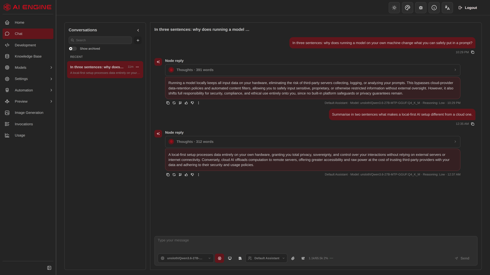
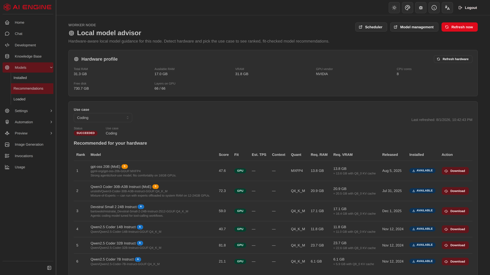
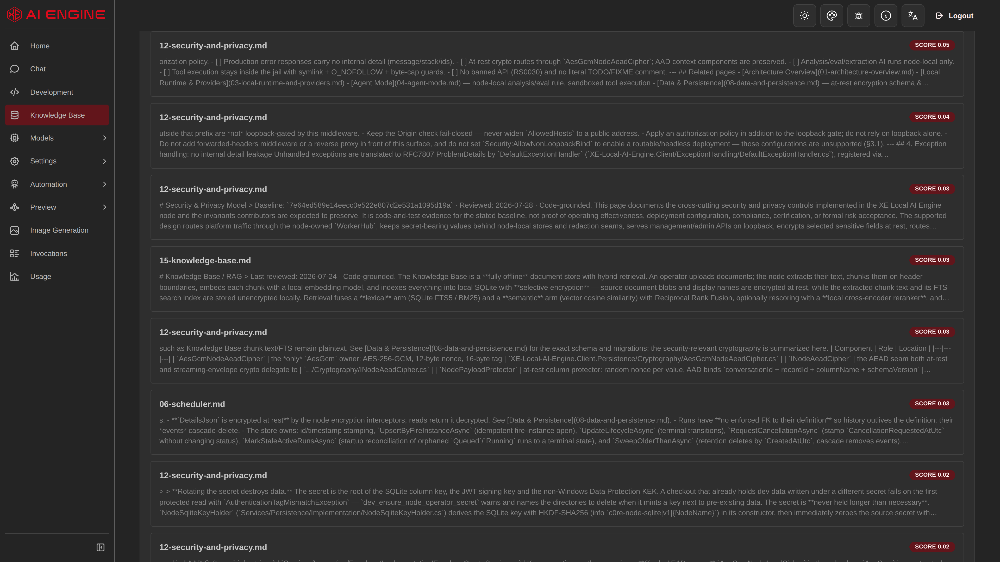
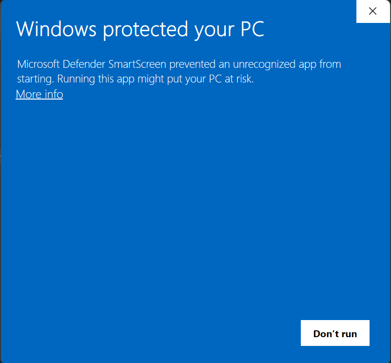

# XE-Local-AI-Engine — user guide

**An all-in-one AI application that runs on your own computer.** Chat with AI models, search your own
documents, build agents, generate images — without sending any of it to a cloud service.

This repository is the public, open-source home of the app — it contains the source code, released
under Apache-2.0. This page is the user guide: how to download, install and use the app itself.

> **New here?** You are in the right place. Start with [**Getting started**](#getting-started) below.
> You do not need to be a developer, and you do not need to understand any of the technical terms on
> this page — every one of them is explained in plain language in the [**Glossary**](docs/glossary.md).
>
> **Already run local models?** Skip all of that →
> [**the technical summary**](docs/for-experienced-users.md): pinned llama.cpp build, launch-flag
> handling, the RAG defaults, and what isn't implemented.

---

## Contents

| I want to… | Go to |
|---|---|
| **I already run llama.cpp / Ollama / LM Studio** | [**Technical summary**](docs/for-experienced-users.md) — skip the hand-holding |
| **See what it can do** | [Feature tour](docs/features.md) |
| **Download the app (new to GitHub?)** | [Downloading from GitHub](docs/download-from-github.md) |
| **Install it on Windows** | [Windows installation guide](docs/install-windows.md) |
| **Install it on Linux** | [Linux installation guide](docs/install-linux.md) |
| **Know what happens on first launch** | [First run](docs/first-run.md) |
| **Fix a problem** | [FAQ & troubleshooting](docs/faq.md) |
| **Understand a word I don't know** | [Glossary](docs/glossary.md) |
| **Know what leaves my computer** | [Privacy & your data](docs/privacy-and-data.md) |
| **Update to a newer build** | [Updating](docs/updating.md) |
| **Send feedback or report a bug** | [Giving feedback](docs/feedback.md) |
| **Download the latest build** | [Releases](https://github.com/w0rldx/XE-Local-AI-Engine.Source/releases/latest) |

---

## What it looks like

<p align="center">
  
</p>

*A conversation answered by a model running on the machine itself. Nothing in this exchange left the
computer.*

<p align="center">
  
</p>

*The app measures your hardware and tells you which models will actually run on it — instead of leaving
you to guess.*

<p align="center">
  
</p>

*Your own documents, searched locally and used to answer questions.*

**[→ See every feature, explained with screenshots](docs/features.md)**

---

## Getting started

### Step 1 — Check your computer can run it

|  | Minimum | Comfortable |
|---|---|---|
| **Operating system** | Windows 10/11 (64-bit) **or** a current 64-bit Linux | Windows 11, or Linux with an up-to-date GPU driver |
| **Memory (RAM)** | 8 GB | 16 GB or more |
| **Free disk space** | 5 GB | 30 GB or more (models are large) |
| **Graphics card** | Not required — works on the processor alone | An NVIDIA, AMD or Intel GPU makes it much faster |
| **Internet** | Required for the first launch and downloads | — |

A graphics card is **optional**. Without one the app still works; answers just arrive more slowly.

> **Windows and Linux, both x64.** The Linux build is portable and **does not update itself** — see
> [Linux installation](docs/install-linux.md). There is no macOS build and no ARM build.

### Step 2 — Download the app from GitHub

GitHub is built for programmers and the download page confuses almost everyone the first time. Here is
exactly what to do.

**1. Open the releases page:** [**→ Latest release**](https://github.com/w0rldx/XE-Local-AI-Engine.Source/releases/latest)

**2. ⚠️ Do NOT use the green `<> Code` button** if you just want to run the app. It downloads this
repository's **source code**, not a ready-to-run build — there is nothing to double-click inside it.
That button is for developers who want to build the app themselves; everyone else wants the Releases
page instead. This is the single most common mistake.

**3. Scroll to "Assets" and click it to expand.** It is often collapsed behind a small ► triangle.
You will see a list like this:

```
▼ Assets                                                    7

   XE-Local-AI-Engine-win-Portable.zip                  ✅ WINDOWS — download this
   XE-Local-AI-Engine-<version>-linux-Portable.zip      ✅ LINUX — download this
   XE-Local-AI-Engine-<version>-linux-Portable.zip.sha256   (Linux checksum)
   XE-Local-AI-Engine-<version>-delta.nupkg             ❌ ignore
   XE-Local-AI-Engine-<version>-full.nupkg              ❌ ignore
   releases.win.json                                    ❌ ignore
   RELEASES                                             ❌ ignore

   Source code (zip)                                       ❌ ignore
   Source code (tar.gz)                                    ❌ ignore
```

**4. Windows: click `XE-Local-AI-Engine-win-Portable.zip`** — about 100 MB. **Linux:** grab the
`...-linux-Portable.zip` instead and follow the [Linux guide](docs/install-linux.md). (`<version>` is a
placeholder for the build number, e.g. `v0.1.0-rc.5.0`.) The other files are for the Windows app's own
updater; you never open them.

**5. If your browser blocks it** (Edge/Chrome: *"is not commonly downloaded"*), open your downloads
list with `Ctrl`+`J`, click the `⋯` next to the file and choose **Keep** → **Keep anyway**. Same cause
as the Windows warning below: the build is unsigned.

**Check you got the right file:** it should be named `XE-Local-AI-Engine-win-Portable.zip` and be
**90–100 MB**. If it's only a few hundred KB, you downloaded the source code by mistake — go back to
point 2.

There is **no installer** and no `Setup.exe`. You unzip a folder and run it.

*More detail, checksum verification, and how to get emailed about new builds:*
[**Downloading from GitHub**](docs/download-from-github.md)

### Step 3 — Install and run

Follow the [**Windows installation guide**](docs/install-windows.md).

> ### ⚠️ Windows will warn you. This is expected.
>
> The app is **not code-signed yet**, so Windows shows a blue **"Windows protected your PC"** box.
>
> **The "Run anyway" button is hidden until you click "More info" first.** Many people get stuck here
> and assume the app is broken — it isn't.
>
> The installation guide has [**step-by-step screenshots of exactly what to click**](docs/install-windows.md#the-windows-smartscreen-warning),
> plus a way to avoid the warning entirely.
>
> <p align="center">
>   
> </p>
>
> *Only "Don't run" is visible. **"More info"** is the small link — click it and "Run anyway" appears.*

---

## What it can do

Everything below runs **on your own machine** unless you deliberately connect an outside service.

*A summary — the [**feature tour**](docs/features.md) shows each of these with screenshots.*

<details open>
<summary><b>The basics</b> — what most people will use</summary>

- **Chat** with AI models running locally, with streaming answers
- **Find and download models** from Hugging Face without leaving the app
- **Hardware-fit advice** — the app measures your RAM, VRAM and GPU, then recommends models that
  genuinely fit, including which quality/size trade-off ("quantization") to pick. *(VRAM can't be read
  on AMD/Intel under Windows yet, so advice there is less precise.)*
- **Documents & knowledge bases** — add your own files and ask questions about them

</details>

<details>
<summary><b>Going further</b> — for people who want to build things</summary>

- **Agents** — configurable assistants with their own instructions, persona, tools, skills and memory
- **Sub-agents** — agents that can call other agents
- **Scheduling** — run a saved agent automatically on a timetable, with run history and cancellation
- **Adaptive memory** — agents remember useful facts across conversations, extracted by a local model.
  Candidates go through a **best-effort scan for things that look like secrets** first — pattern-based,
  so treat it as a safety net rather than a guarantee
- **MCP servers** — connect external tool servers to your agents
- **Skills** — a local library of capabilities agents can load on demand

</details>

<details open>
<summary><b>Experimental</b> — rough edges expected</summary>

- **Development Mode** — an agent works on a real Git repository of yours in an isolated copy, with a
  reviewed approval step before anything is written back. It ships **enabled** (there is no switch to
  leave off); what gates it is that it only acts once you register a repository.
  **Read the [security boundary](docs/privacy-and-data.md#development-mode-and-its-limits) before you
  register one. Never point it at code you do not trust.**
- **Image generation** — generate images locally. Grouped as a preview feature in the app.
- **Canvas** — a visual workspace for wiring up multi-step workflows
- **Read answers aloud** — local text-to-speech in the browser. Currently sits **behind a developer
  setting** rather than being on by default, so it is not available out of the box yet.
- **Optional cloud providers** — Azure AI Foundry and Codex, if you want them. Entirely optional.
- **Ollama** — if you already run Ollama, the app can use its models. It will not install or manage
  Ollama for you.

</details>

### Not included yet

- **No speech-to-text** — the app can talk, but it cannot listen. This is not two-way voice chat.
- **No macOS build**, no ARM build.
- **No self-update on Linux** — the Windows build updates itself; the Linux one is replaced by hand
  (see [Linux](docs/install-linux.md)).

---

## Honest expectations

This is an early beta, built by **one person** in their spare time alongside a full-time job. Please
read these before you start, so nothing comes as a surprise:

- **The starter model is deliberately tiny.** The app downloads a very small model (~400 MB) on first
  launch just to prove chat works. **It is not representative of the quality this app can deliver** —
  it will feel weak, and that is expected. Use the built-in advisor at **Models → Recommendations** to pick a real model
  for your hardware. [How to do that →](docs/first-run.md#step-4--get-a-model-that-is-actually-good)
- **Windows will warn you on first launch**, because the build is unsigned. [What to click →](docs/install-windows.md#the-windows-smartscreen-warning)
- **Expect rough edges.** This is early, actively-developed software.
- **Your database is not fully encrypted.** Sensitive fields are individually encrypted, but extracted
  document text is not. [Details →](docs/privacy-and-data.md)
- **Keep backups of anything you care about.** Do not make this app the only place important data lives.

---

## Getting help

Stuck? Nothing is too basic a question — being stuck is itself useful feedback.

1. Check the [**FAQ & troubleshooting**](docs/faq.md) — it covers the common problems.
2. Still stuck? [**Open an issue**](https://github.com/w0rldx/XE-Local-AI-Engine.Source/issues/new/choose) or message me on Reddit.

When reporting a problem, the [feedback guide](docs/feedback.md) explains what to include. Even
"I opened it and didn't understand what to do next" is a genuinely valuable report.

---

## About this project

- This is an **early beta**, built and maintained by **one person**.
- There is **no required feedback report** and no obligation to review or promote anything.
- The project is **open source**, licensed under **[Apache-2.0](../../LICENSE)** — you're free to use,
  modify and redistribute it under that licence.

Thank you for trying it. Genuinely — honest impressions from people on hardware I do not own is the
single most useful thing for this project right now.
