# What the app can do

A tour of the features, with pictures of each one from the running application.

Everything here runs **on your own computer** unless you deliberately connect an outside service.

> **Want to try it?** → [**Download and install it**](download-from-github.md) *(about 10 minutes)*

**Jump to:** [Chat](#chat) · [Finding & choosing models](#finding-and-choosing-models) ·
[Managing models](#managing-models) · [Your documents](#your-own-documents) ·
[Agents](#agents) · [Custom tools](#custom-tools) · [Automation](#automation) · [Voice](#voice) · [Images](#image-generation) ·
[Development Mode](#development-mode) · [Advanced](#advanced)

---

## Chat

The core of the app: a conversation with an AI model running on your own hardware.

Replies stream in word by word as the model produces them. You can see which model is answering and
switch models per message, and a badge shows how much of the model's memory the conversation is using
so you know when it's getting full.

**[▶ Watch it streaming](../media/clips/chat-streaming.mp4)** *(short clip — opens on GitHub)*

Also available: file attachments, per-message model selection, adjustable reasoning effort for models
that support step-by-step thinking, and advanced sampling controls if you want to experiment.

> **New to this?** [Context, tokens and reasoning explained](glossary.md#context-context-window)

---

## Finding and choosing models

Picking a model normally means guessing whether it will fit in your memory, and choosing between a
dozen cryptically-named files. The app measures instead.

### The app measures your machine first

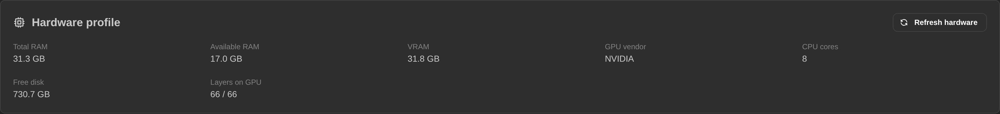

It profiles your memory, graphics card and VRAM — then bases every recommendation on that, rather than
on generic advice.

> **On AMD and Intel cards under Windows the app cannot yet read VRAM**, so recommendations for those
> GPUs fall back to sizing from system RAM and are less precise.
> [What to do if a model won't load](faq.md#a-model-wont-load--out-of-memory)

### Then it recommends models that actually fit

Models are ranked by whether they genuinely run well on *your* hardware, with a **★ Recommended** pick.
If you're unsure what to choose, taking the recommendation is the right move.

### Search Hugging Face without leaving the app

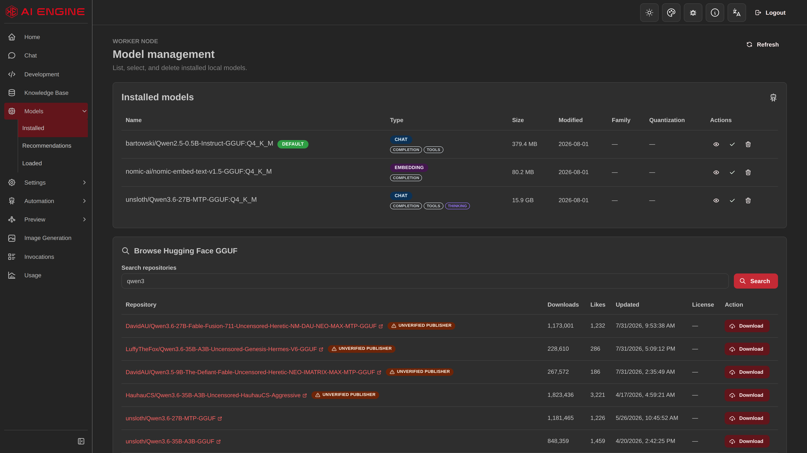

Hugging Face is a large public library of AI models. You can search and download from it directly here.

**[▶ Watch discovery and download](../media/clips/model-discovery.mp4)** *(short clip — opens on GitHub)*

### Every download option, explained

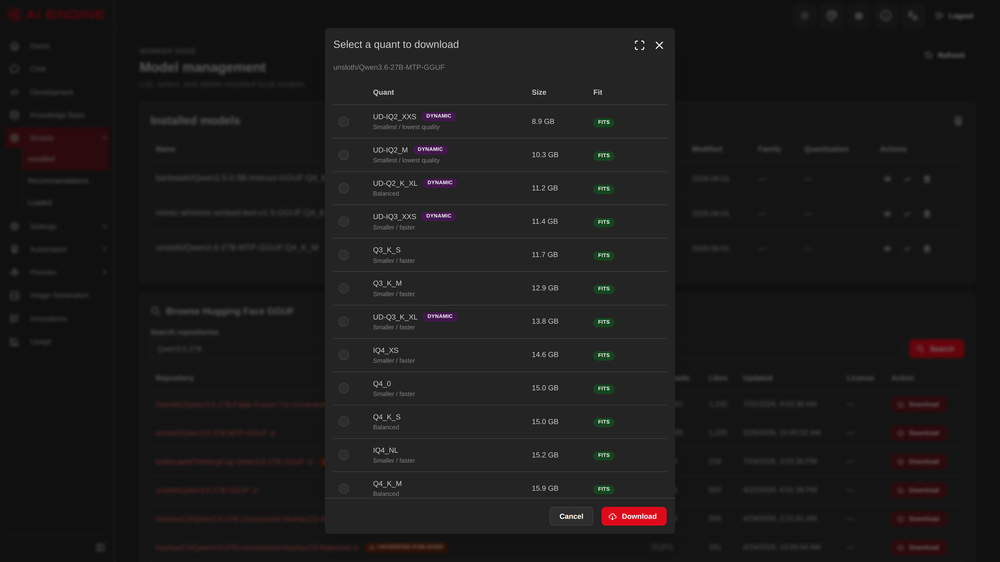

Models come in several compressed versions ("quantizations") that trade quality against size. Instead
of a raw file list, each option shows its **quality tier**, its **real download size**, and **whether it
fits your machine** — plus a recommended pick.

> [What quantization means](glossary.md#quantization-q4_k_m-q5_k_m-q8_0)

---

## Managing models

### See what you have

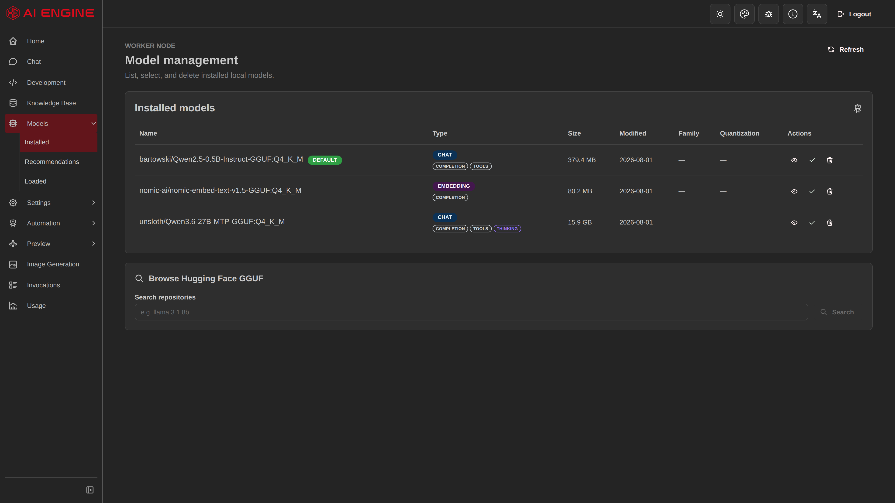

Installed models with their detected capabilities — whether each supports tools, thinking, and so on.

### See what's using memory, and free it

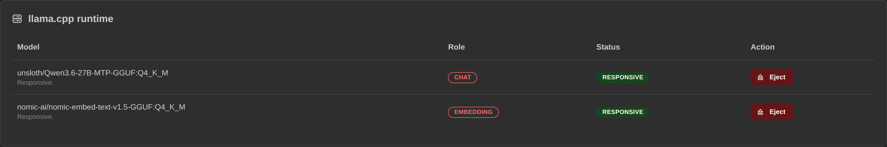

A live view of what's currently loaded. **Eject** unloads a model to free VRAM without closing the app —
useful when switching between chat and image generation. It waits for work in progress rather than
killing it.

### Consistent performance per machine

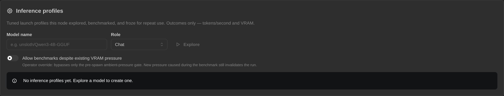

The best launch settings for a model on *your* machine are worked out once, then frozen and reused —
so performance doesn't drift between sessions.

---

## Your own documents

Add your files to a **knowledge base**, then ask questions about them. The model answers from your
actual documents rather than from memory.

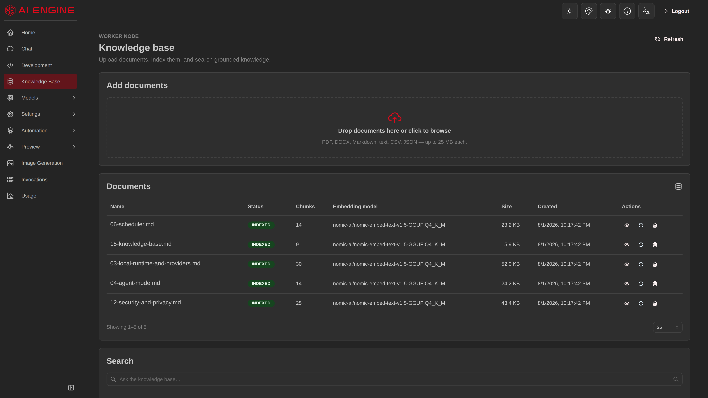

Documents are processed and indexed locally. Nothing is uploaded anywhere.

### Search that combines two approaches

Keyword search finds exact terms; meaning-based search finds passages that say the same thing in
different words. The app runs **both and merges the results**, then optionally re-ranks them with a
local model for accuracy. Fully offline.

**[▶ Watch a document question answered](../media/clips/knowledge-rag.mp4)** *(short clip — opens on GitHub)*

> ⚠️ **Privacy note:** extracted document text and its search index are **not encrypted**, because
> local search must read them. [What this means for you](privacy-and-data.md#what-is-encrypted-and-what-is-not)

---

## Agents

An **agent** is a configured assistant — its own instructions, personality, chosen model, and the tools
it's allowed to use. Think "a specialist" rather than "a general chatbot".

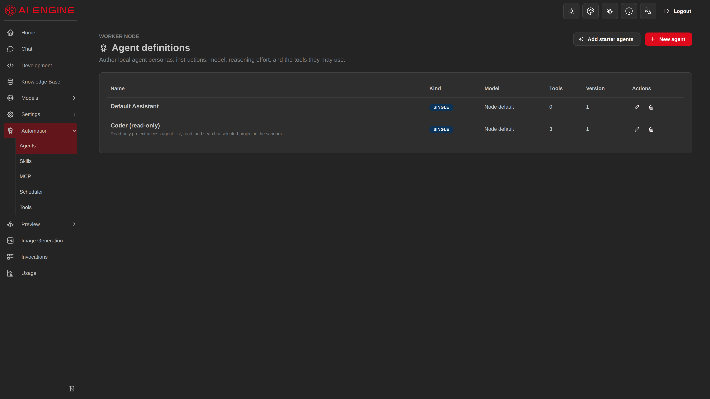

The app ships with a set of ready-made agents, and you can create your own.

### Configure them in detail

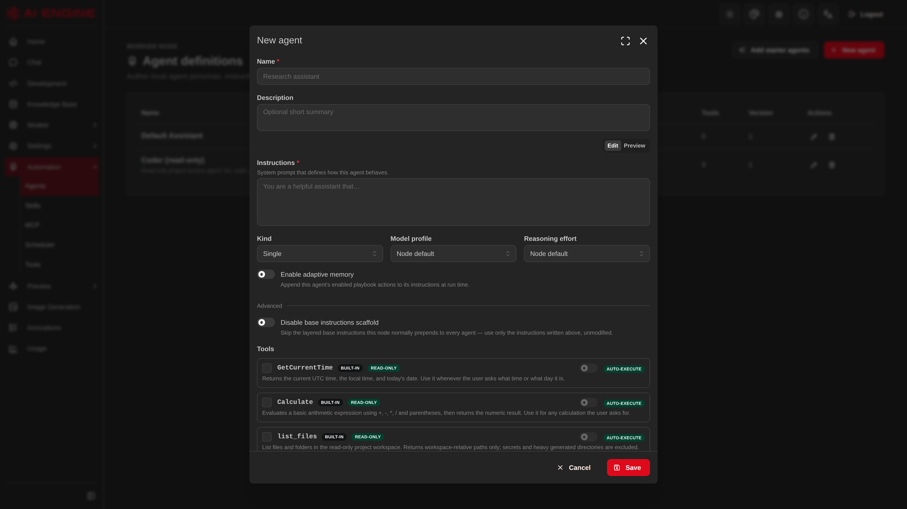

Instructions, model pin, reasoning effort, memory behaviour and which tools the agent may use.

**Adaptive memory** lets an agent remember useful facts across conversations. Candidate memories are
extracted by a local model and put through a **best-effort scan for things that look like secrets**
(API keys, tokens) before being stored.

It is pattern-based, so treat it as a safety net rather than a guarantee — don't rely on it to keep a
credential out of an agent's long-term memory.

### Skills

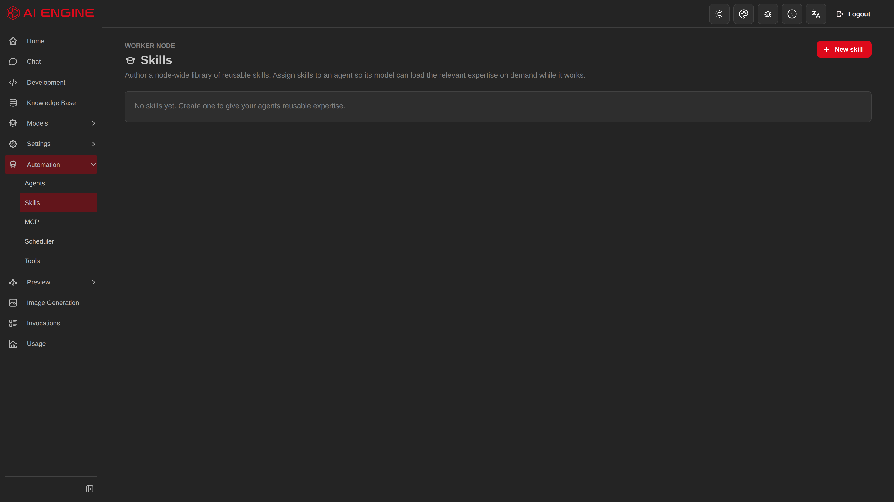

A local library of capabilities agents can load on demand for specific kinds of work.

### External tools via MCP

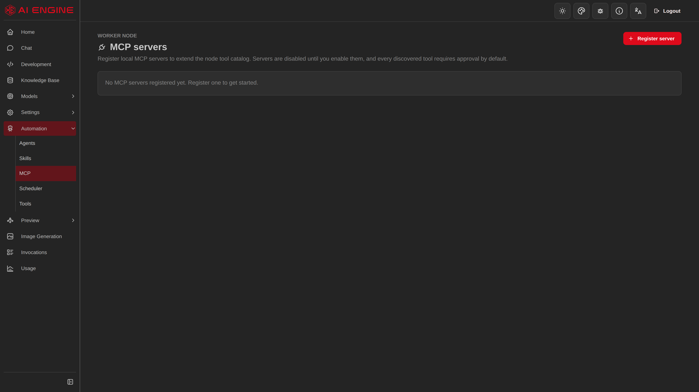

[MCP](glossary.md#mcp) is an open standard for connecting external tool servers to AI applications.
Registered servers have their tools offered to your agents.

> ⚠️ **An MCP server is a separate program, usually written by someone else, that the app launches —
> and it runs as you, with your permissions.** That is the same boundary as Development Mode. Only
> register servers you'd be willing to install and run yourself.
> [More](privacy-and-data.md#what-connects-to-the-internet)

### Custom tools

**Automation → Custom tools** lets you author either an HTTP fetch or a direct host-program launch and
assign it to an agent. A tool can be fixed or expose a declared set of model-filled parameters.

> ⚠️ **These tools run with your access.** HTTP tools can send data to allowed network hosts, and
> command tools launch a program directly on this machine. The node-wide switch is off by default,
> the built-in authoring form initializes a new tool as disabled, saving requires an explicit danger
> acknowledgement, and every call remains approval-wrapped. An API caller can request enablement when
> creating an acknowledged definition. A fixed tool can reuse an explicit session approval until the
> tool is edited; a parameterized tool asks again for every model-selected argument set. Those gates
> reduce accidental use; they do not turn an untrusted command or remote service into a sandboxed one.

Secret HTTP headers and command environment values are stored encrypted and are masked when you edit
the tool later. Parameterized HTTP tools require explicit allowed hosts; command tools require an
absolute, non-shell executable path.

---

## Automation

### Run agents on a schedule

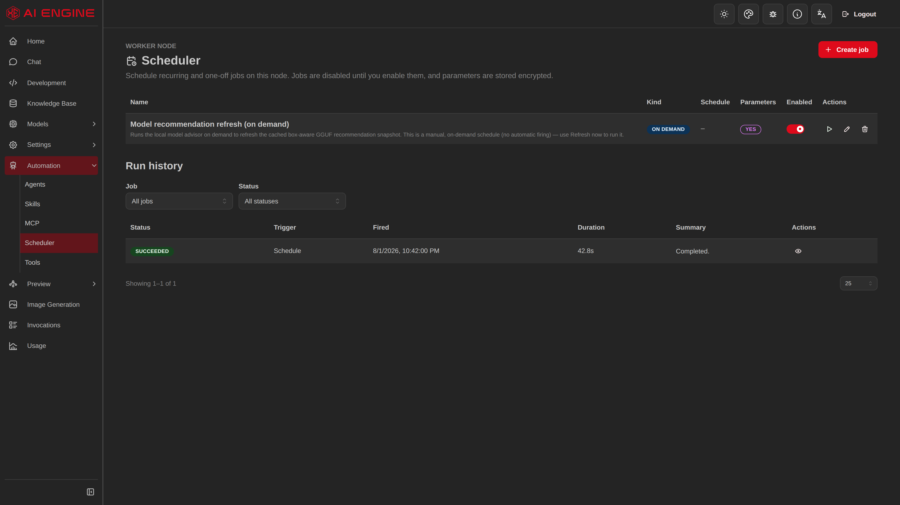

A saved agent can run unattended on a timetable — with full run history, the ability to cancel a run,
and an automatic timeout so a stuck run can't hang forever.

---

## Voice

The app can **read replies aloud** through voices exposed by your browser and operating system. There
is no voice model bundled with or downloaded by the app, and voice output does not use the app's GPU
or model runtime.

The available voices, languages, quality, offline support, and network behavior depend on the browser
and operating-system speech implementation. Those platform services are outside this repository's
control, so the app cannot guarantee that a particular system voice works offline.

> ⚠️ **No speech-to-text.** The app can talk, but it cannot listen — this is not two-way voice chat.

---

## Image generation

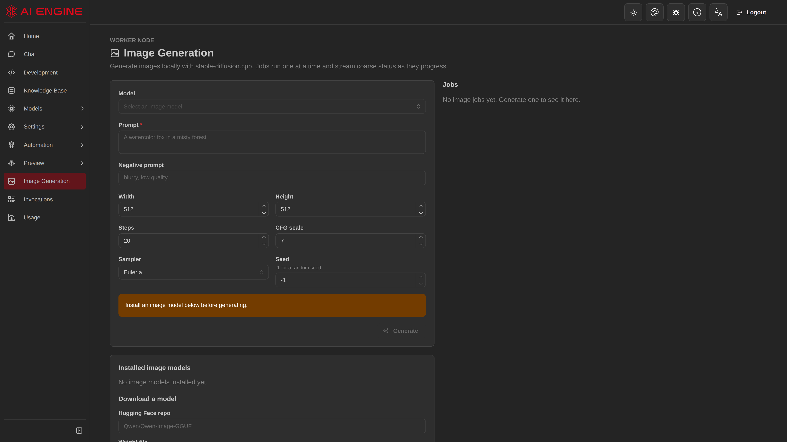

Generate images on your own machine. Jobs are queued and cancellable, one model is loaded at a time
(image models are memory-hungry), and unused models are unloaded automatically.

**Generated images are encrypted at rest.**

Still rough around the edges — feedback especially welcome here.

---

## Development Mode

> ### ⚠️ Experimental, and genuinely risky. [Read the security boundary first.](privacy-and-data.md#development-mode-and-its-limits)

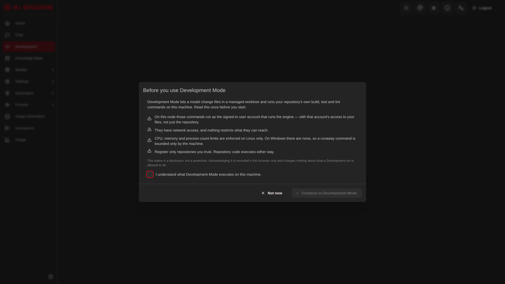

An agent works on a real Git repository of yours — reading code, making changes, running builds and
tests. It works in an **isolated copy**, and changes reach your actual source only through an explicit,
reviewed, hash-checked apply step.

**What it is not:** an operating-system sandbox. Builds and scripts run **as your user account**, with
your file and network access. The protections are application-level.

> **Never point it at code you don't trust.**

---

## Advanced

### Usage accounting

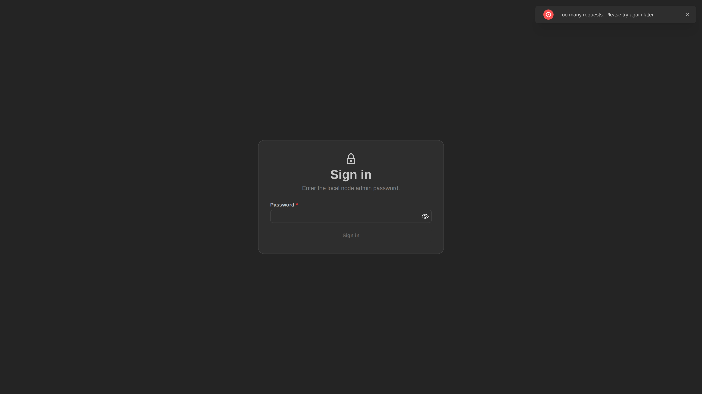

Token and invocation counts, tracked locally. **Not reported anywhere** — this is for your information
only.

### Building a CUDA engine in-app (Linux)

Upstream publishes no prebuilt Linux CUDA component, so the app can **compile one locally** — pinned to
an exact upstream version, refusing to proceed if the source doesn't match, with the build log streamed
live into the interface.

This needs testing across distributions and drivers. → [Installing on Linux](install-linux.md)

### Canvas

An experimental visual workspace for wiring up multi-step workflows.

### Optional cloud providers

Azure AI Foundry and Codex can be connected if you want them. **Entirely optional** — the app is built
to work without any of them.

### Ollama

If you already run [Ollama](glossary.md#ollama), the app can list and use its models. It won't install
or manage Ollama for you, and if it isn't running, nothing breaks.

---

## Getting started with all this

Don't try to use everything at once. → [**First run**](first-run.md) walks through the first session,
and the most valuable thing you can do early is
[swap the starter model for a real one](first-run.md#step-4--get-a-model-that-is-actually-good).

**[← Back to the main page](../README.md)**
