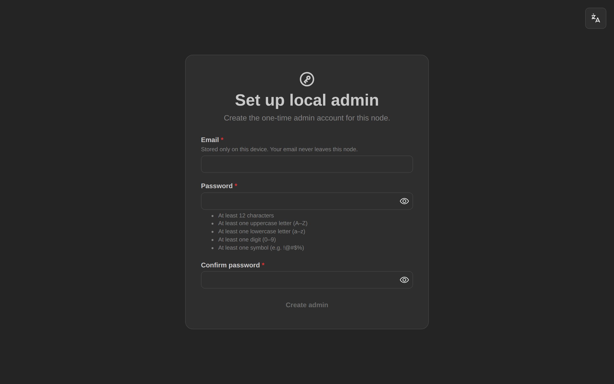
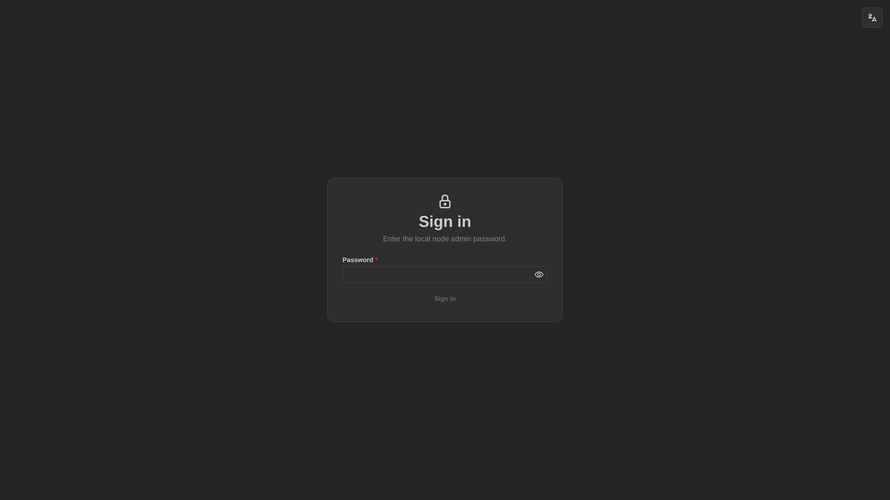
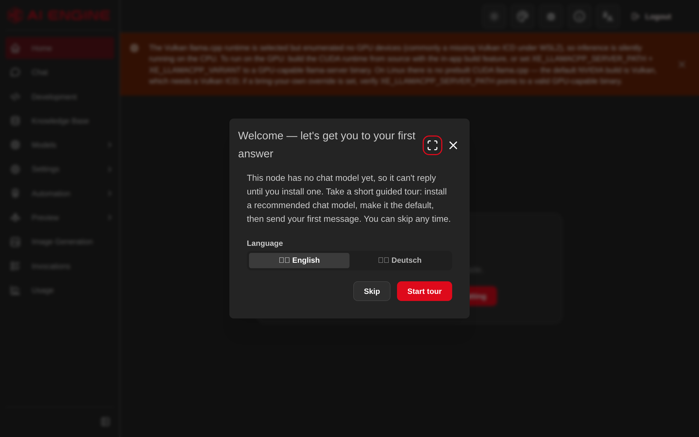

# Your first run

What happens the first time you start the app, and what to do in it.

On a new installation, create your local profile and choose how the engine may access the internet.
If you enable automatic setup, allow time for the runtime and starter model to download; the time
needed depends on your connection.

---

## Step 1 — Create your local profile

You'll see **"Set up local admin"**, asking for an email address and a password.

> **"Admin" here does not mean Windows Administrator.** It means the owner account *inside this app* —
> the first user of your own installation. It has nothing to do with Windows administrator rights, and
> the app never asks for them.

> ### This is not an online account
>
> You are **not** signing up for anything, and nothing is sent anywhere. This creates a login on your
> own computer, stored on your own disk. The screen says so too: *"Stored only on this device. Your
> email never leaves this node."*
>
> The email is just an identifier — never contacted, never verified, never transmitted. **A made-up
> address is fine.**

### The password rules are strict

This catches people out. Your password must have **all** of:

- At least **12 characters**
- An **uppercase** letter (A–Z)
- A **lowercase** letter (a–z)
- A **digit** (0–9)
- A **symbol** (e.g. `!@#$%`)

The **Create admin** button stays greyed out until every rule is met. If nothing seems to happen when
you click it, check the list — one unmet rule is usually why.

> ### ⚠️ Write this password down somewhere safe
>
> There is **no "forgot password" email**, because there is no server that could send one. If you do
> lose it, you can set a new one with a short one-line command **without losing your data**.
> → [I forgot my password](faq.md#i-forgot-my-password)

**After this, signing in asks for the password only** — not the email. The email is not your username;
it is just stored with the account.

  

---

## Step 2 — Choose external access

After creating your profile, choose **Recommended** or **Offline / Manual**:

- **Recommended** enables automatic application and llama.cpp update checks, and first-run runtime
  and starter-model downloads.
- **Offline / Manual** disables those automatic actions. Install or import a model yourself before
  chatting. This choice is not a firewall: configured integrations and model-catalog lookups can
  still use the network.

You can change this choice later in **Node Settings**. Automatic provisioning waits for this decision;
waiting at the account-setup screen will not download a model for you.

### Choose Simple or Advanced

Next, choose how much of the application you want to see and click **Continue**. **Simple** shows the
everyday tools, including chat, agents, models, knowledge, images and transcription. **Advanced** also
shows tools such as scheduling, workflows, integrations, benchmarks and training. This choice does not
delete anything, and you can change it later in **Node Settings**.

---

## Step 3 — Install a model

With **Recommended**, a fresh desktop installation downloads the llama.cpp runtime and a small
starter model in the background. Follow the runtime and model download progress in the app. The
engine's listening address means the app is reachable; it does not mean a model has finished downloading.

With **Offline / Manual**, use **Models → Installed** to download or import a model. Runtime acquisition
also needs internet access unless you have already supplied the required runtime locally.

If setup fails or progress stops, check the visible error and the application logs, confirm internet
access and free disk space, then retry the failed download from model management. If the problem
persists, retain the error and [report it](feedback.md).

**Do not delete the data directory as a troubleshooting step.** It contains your account, chats,
settings, keys and downloaded models. A deliberate reset is destructive and is a separate operation.

---

## Step 4 — Have your first chat

Once you're in, there's a guided tour you can follow, or you can go straight to **Chat** and type
something.

  

Once a chat model is installed, select it in Chat if it is not already selected, then send a message.

  

**If a reply appears, everything is working.** That is genuinely the milestone for the first session —
the rest can wait.

---

## Step 5 — Get a model that is actually good

> ### ⚠️ Please read this part — it prevents the most common bad first impression
>
> The starter model is **tiny — 0.5 billion parameters**. It exists purely to prove that chat works on
> your machine without a huge download.
>
> **It will feel dumb.** It forgets things, gets facts wrong, and rambles. That is the model, not the
> app, and it is **not** what this software is capable of.
>
> Swapping it for a real model takes about five minutes and transforms the experience. Please do this
> before forming an opinion.

### Let the app choose for you

Go to **Models → Recommendations** in the left sidebar. It measures your actual hardware — memory,
graphics card and VRAM — and recommends models that will genuinely run well on *your* machine.

> **AMD/Intel on Windows:** VRAM can't be read yet, so advice for those cards is based on system RAM
> and is less precise. If a recommended model won't load, step down one size or quantization level.

  

Look for the **★ Recommended** pick and download it. Larger models are more capable but slower and need
more memory; the advisor already accounts for that, so **trusting its recommendation is the right move**
if you're unsure.

<b>What the numbers mean</b> (optional reading)

- **Parameters (0.5B, 7B, 14B…)** — roughly, model size. Bigger is usually smarter and always slower.
- **Quantization (Q4_K_M, Q8_0…)** — compression. Lower numbers = smaller and faster, but slightly less
  accurate. `Q4_K_M` is the usual sweet spot.
- **FITS / doesn't fit** — whether it can load into your memory at all.

All of these are explained properly in the [Glossary](glossary.md).

### Or browse yourself

On the **Models → Installed** page there's a Hugging Face browse panel — search that public library of
models from inside the app. Each download option is labelled with its size and whether it fits your
hardware.

  

---

## Step 6 — Explore, at your own pace

No need to do these in order, or at all.

Everything below is in the **left sidebar**. `Group → Item` means: click the group to expand it, then
click the item.

| Try this | Where in the sidebar | Good for |
|---|---|---|
| **Ask about your own documents** | **Knowledge Base** | Notes, PDFs, manuals |
| **Make a custom assistant** | **Automation → Agents** | An agent with your own instructions and persona |
| **Generate an image** | **Preview → Image Generation** | Local image generation |
| **Run an agent on a schedule** | **Automation → Scheduler** | Unattended, repeating tasks |
| **Give agents extra abilities** | **Automation → Skills** | Loadable capabilities |
| **Create a local HTTP or command tool** | **Automation → Custom tools** | Advanced and high-risk — approval-wrapped; parameterized tools ask every call |
| **Connect external tools** | **Automation → MCP** | Advanced — see the [Glossary](glossary.md#mcp) |
| **Draw a workflow and run it** | **Graph Workflows** | Chain agent steps, tool calls, conditions and an approval step into a diagram, then start a run and watch it |
| **Bring in a `.gguf` you already have** | **Models → Installed** → *Import model* | One file at a time; it's [copied, not moved](faq.md#can-i-use-gguf-models-i-already-have) |
| **Find out which model is actually better** | **Benchmarks** | Running your own task against several models and scoring the results |
| **Fine-tune a model on your own data** | **Training** | Advanced — [**Linux with an NVIDIA card only**](features.md#fine-tuning-training) |
| **See what's using memory** | **Models → Loaded** | Freeing up VRAM |
| **Change settings** | **Settings → Node Settings** | Voice, and everything else |
| **Export a bug report** | **Settings → Diagnostics** | [Reporting problems](feedback.md) |

> **Development Mode** lets an agent edit a real code repository of yours. It is powerful and
> **genuinely risky**.
>
> It ships enabled, but an operator can turn the whole feature off with
> `Development:Enabled=false`. When enabled, it only touches a repository once *you register one and
> start a run*. Please read
> [its security boundary](privacy-and-data.md#development-mode-and-its-limits) **before you register a
> repository**, and never point it at code you do not trust.

---

## Stopping and starting again

- **To stop:** close the **console window** (not just the browser tab).
- **To start again:** run `XE-Local-AI-Engine.exe` from the same folder.

Your models, chats and settings are all still there — they live in a separate data folder, not in the
app folder.

---

## What good feedback looks like right now

If you only tell me one thing, make it one of these:

- **Where did you get stuck or confused?** Especially in the first 10 minutes.
- **What did you expect to happen that didn't?**
- **Was it fast enough to be useful on your hardware?** (Please mention your GPU/CPU and RAM.)
- **What would stop you using this for real work?**

→ [How to send feedback](feedback.md)

---

## Something went wrong?

→ [**FAQ & troubleshooting**](faq.md)

---

**[← Back to the main page](../README.md)**
