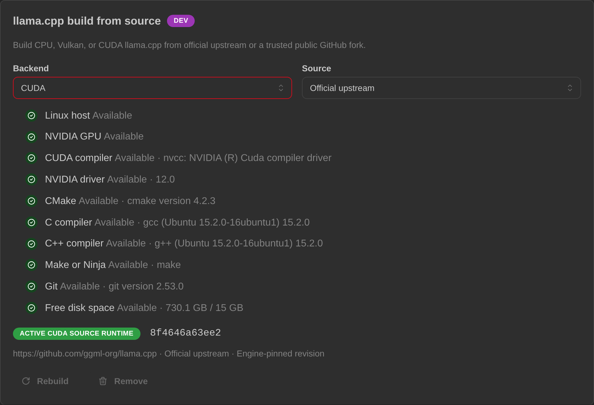

# Installing on Linux

**Time needed:** about 5 minutes to install, plus 5–15 minutes on first launch while the app downloads
what it needs.

There is **no installer and no package**. You download a ZIP file, unzip it, and run the app from that
folder. To remove it later you run the bundled uninstaller and delete the folder.

> ### One important difference from the Windows build
>
> **The Linux build does not update itself.** The Windows build has a working in-app updater; this one
> deliberately ships with that feature switched off, because a portable ZIP is not something an updater
> can safely rewrite in place. Updating means downloading the next ZIP by hand — it takes a minute, and
> [it does not touch your data](#updating-to-a-new-version).

---

## The short version

For people who have done this kind of thing before:

1. Download `XE-Local-AI-Engine-<version>-linux-Portable.zip` from [Releases](../../../releases/latest).
2. `unzip` it somewhere you own — it expands into a versioned folder.
3. `./start-xe-local-ai-engine.sh`
4. A terminal fills with logs and your browser opens on `http://127.0.0.1:<port>/`. Leave the terminal open.

Everything below is the same thing, explained slowly.

---

## Before you start

| | |
|---|---|
| **Architecture** | **x64 only.** No ARM build exists — Raspberry Pi, ARM laptops and ARM VMs are out. |
| **Disk** | ~2 GB free for the app, the AI engine and a starter model. More once you download bigger models. |
| **GPU** | Optional. CPU works. See [Getting your GPU used](#getting-your-gpu-used). |
| **Distribution** | Anything reasonably current with glibc. The build is self-contained — no .NET install needed. |

---

## Step 1 — Download the app

1. Go to the [**Releases page**](../../../releases/latest).
2. Under **Assets**, click **`XE-Local-AI-Engine-<version>-linux-Portable.zip`** (roughly 90 MB).

For the current release that file is:

```
XE-Local-AI-Engine-0.1.0-rc.5.0-linux-Portable.zip
```

> **Never downloaded from GitHub before?** The page is genuinely confusing — the big green **`<> Code`**
> button is *not* the app, and the file list is often collapsed.
> **[→ Step-by-step download walkthrough](download-from-github.md)**

You will see several other files. **On Linux you need exactly one of them:**

| File | What it's for |
|---|---|
| `XE-Local-AI-Engine-<version>-linux-Portable.zip` | **← this is the one you want** |
| `XE-Local-AI-Engine-<version>-linux-Portable.zip.sha256` | optional checksum, see below |
| `XE-Local-AI-Engine-win-Portable.zip` | the Windows build — not for you |
| `...-full.nupkg`, `...-delta.nupkg` | used by the **Windows** app's built-in updater |
| `releases.win.json`, `RELEASES` | the update list the **Windows** app reads |

> **Don't see any files?** The Assets list may just be collapsed — click the word "Assets" (or the
> small ► triangle) to expand it. If files are genuinely missing, it may be a temporary GitHub issue;
> try again shortly or [open an issue](../../../issues/new/choose).

### Checking your download *(optional)*

A `.sha256` file is published next to the Linux ZIP. Download both into the same folder and run:

```sh
sha256sum -c XE-Local-AI-Engine-*-linux-Portable.zip.sha256
```

`OK` means the file is byte-for-byte what I published. GitHub also shows its own SHA-256 digest beside
each asset, which you can compare against `sha256sum <file>` directly.

---

## Step 2 — Unzip it

```sh
unzip XE-Local-AI-Engine-*-linux-Portable.zip -d ~/apps
```

The ZIP expands into **a folder named after the version**, so different versions never overwrite each
other and you can always see which build you are looking at. Move into whatever folder it just created
— if you're not sure of the exact name, list it first:

```sh
ls ~/apps               # shows the folder the unzip just created
cd ~/apps/<that-folder> # move into it
```

> **Avoid these locations:**
> - Anywhere needing `sudo` — the app never needs root, and running it as root will scatter
>   root-owned files through your home directory
> - A synced folder (Dropbox, Nextcloud, ~/Insync) — sync will fight the app over its files
> - A network share or USB stick — too slow, and it will feel broken

Inside you'll find `READ-ME-FIRST.txt`, which is the one-screen version of this page.

---

## Step 3 — Run it

```sh
./start-xe-local-ai-engine.sh
```

> ### ⚠️ Use the start script, not the binary next to it
>
> There is a large file called `XE-Local-AI-Engine.Client` in the same folder. It looks like the "real"
> program, and it is not. Launching it directly does not fail loudly — it **skips the desktop setup
> entirely**: no proper data folder, no browser, no working start.
>
> Always use **`./start-xe-local-ai-engine.sh`**.

**Permission denied?** The launcher ships with the executable bit already set, but some graphical
archive tools drop file permissions when extracting. If that happened:

```sh
chmod +x start-xe-local-ai-engine.sh uninstall-xe-local-ai-engine.sh XE-Local-AI-Engine.Client
```

> **There is no SmartScreen equivalent on Linux.** That entire class of "unknown publisher" warning is
> a Windows thing — nothing here will try to stop you running an unsigned build.

---

## Step 4 — What happens next

Two things happen:

1. **Your terminal fills with log messages.** **Leave it open** — closing it stops the app. This is not
   an error; it is the app running.
2. **Your browser opens** on a `http://127.0.0.1:...` address. **The port is chosen automatically and
   differs on every machine** — yours will not match any example anywhere in these docs. Read the real
   one from the terminal.

> **Browser didn't open?** Some desktop environments and most SSH sessions have no default browser to
> launch. Look in the terminal for a line containing `http://127.0.0.1:` and paste **that exact
> address**, port included, into your browser.

**The first launch takes several minutes** and looks like very little is happening. It is downloading
the AI engine and a small starter model in the background. Watch the terminal for progress.

**→ Continue to [First run](first-run.md)** for what to do in the app itself.

---

## Getting your GPU used

**Vulkan is the default path on Linux** — for AMD, Intel *and* NVIDIA cards. That is not a preference;
upstream llama.cpp simply publishes no prebuilt Linux CUDA component, so there is nothing to ship.

**If the app feels extremely slow, check your Vulkan drivers first.** Vulkan needs your distribution's
driver package (an "ICD") installed — `mesa-vulkan-drivers` on Debian/Ubuntu, `vulkan-radeon` /
`vulkan-intel` on Arch, the proprietary driver on NVIDIA. Without one, the app quietly falls back to
running on the CPU. It still works; it is just far slower, and nothing will announce why.

`vulkaninfo --summary` is a quick way to tell whether Vulkan can see your card at all.

### NVIDIA: building a CUDA engine in-app

If you have an NVIDIA card and want more than Vulkan gives you, the app can **compile a CUDA engine
locally on your machine**, pinned to an exact upstream version and refusing to proceed if the
downloaded source doesn't match.

<p align="center">
  
</p>

**This is one of the most valuable things you can try if you have an NVIDIA Linux machine.** It needs to
work across many distributions, drivers and CUDA versions, and it is the least-covered path in the whole
project. If you're willing to run it, that feedback is genuinely valuable — whether it works or not.

---

## Updating to a new version

The Linux build has **no in-app updater**. When a new release appears:

1. Stop the app (close the terminal).
2. Download and unzip the new ZIP — it lands in its own versioned folder next to the old one.
3. Start the new one.
4. Once you're happy it works, delete the old folder.

**Your data is not in the app folder**, so nothing is lost in the process — your account, chats,
settings, models and engines all live under `~/.local/share/XE-Local-AI-Engine` and are picked up by
the new version automatically.

> Do not run the old and new versions at the same time — see below.

---

## Stopping the app

**Close the terminal**, or press `Ctrl+C` in it. Either shuts down the app and the AI engine together,
cleanly.

Do not just close the browser tab — that only hides the interface; the app keeps running.

> **Only one copy runs at a time.** If one is already running, a second launch refuses to start and
> exits with a message. That is the protection working, not a crash — and it is why you should not
> start a new version while the old one is still running.

---

## Where your data lives

```
~/.local/share/XE-Local-AI-Engine
```

(or `$XDG_DATA_HOME/XE-Local-AI-Engine` if you have set that variable.)

Separate from the app folder, and it holds your account, chats, settings, downloaded models and the AI
engine — often **several gigabytes**. Deleting it is a full reset: the app starts fresh, as if newly
downloaded.

---

## Removing it

Unlike the Windows build, Linux ships an uninstaller script:

```sh
./uninstall-xe-local-ai-engine.sh
```

It stops the app and the AI engine, then **asks you to confirm** before deleting your data directory.
Afterwards, delete the unzipped folder yourself:

```sh
rm -rf ~/apps/<the-folder-you-unzipped>   # run `ls ~/apps` first if unsure of the name
```

Prefer to do it by hand? Stop the app, delete the app folder, and delete
`~/.local/share/XE-Local-AI-Engine`.

---

## macOS and ARM

Neither exists — no macOS build, and no ARM build on any platform. Not currently planned.

---

## Still stuck?

→ [**FAQ & troubleshooting**](faq.md) covers the common failures.

→ Or [open an issue](../../../issues/new/choose) — include your distribution and version, your GPU if
relevant, and any red text from the terminal. See [Giving feedback](feedback.md).

---

**[← Back to the main page](../README.md)**
