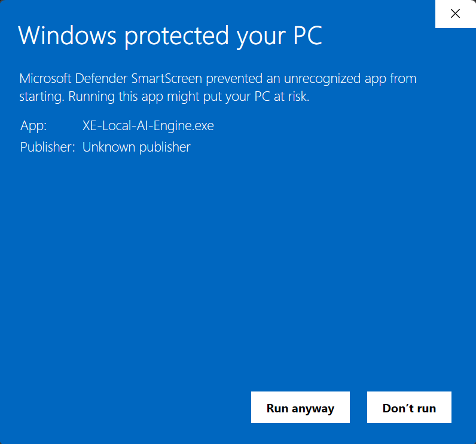

# Installing on Windows

**Time needed:** about 5 minutes to install, plus 5–15 minutes on first launch while the app downloads
what it needs.

There is **no installer**. You download a ZIP file, unzip it, and run the program from the folder. To
remove it later you delete that folder.

---

## The short version

For people who have done this kind of thing before:

1. Download `XE-Local-AI-Engine-win-Portable.zip` and `CHECKSUMS.sha256` from [Releases](https://github.com/w0rldx/XE-Local-AI-Engine.Source/releases).
2. **Right-click the ZIP → Properties → tick "Unblock" → OK.** *(Do this before extracting — it saves
   you the SmartScreen warning.)*
3. Verify its SHA-256 value, then extract it to a writable local directory, e.g.
   `%LOCALAPPDATA%\Programs\XE-Local-AI-Engine`. **Not** Program Files.
4. Run **`XE-Local-AI-Engine.exe`** in the top-level folder — *not* the one inside `current\`.
5. A console window opens and your browser opens the app. Leave the console open.

Everything below is the same thing, explained slowly.

---

## Step 1 — Download the app

1. Go to the [**Releases page**](https://github.com/w0rldx/XE-Local-AI-Engine.Source/releases).
2. Under **Assets**, download **`XE-Local-AI-Engine-win-Portable.zip`** and `CHECKSUMS.sha256`.

> **Never downloaded from GitHub before?** The page is genuinely confusing — the big green **`<> Code`**
> button is *not* the app, and the file list is often collapsed.
> **[→ Step-by-step download walkthrough](download-from-github.md)**

You will see other files listed. **You do not need them:**

| File | What it's for |
|---|---|
| `XE-Local-AI-Engine-win-Portable.zip` | **← the Windows application** |
| `CHECKSUMS.sha256` | **← download this to verify the ZIP** |
| `...-full.nupkg`, `...-delta.nupkg` | used by the app's built-in updater |
| `releases.win.json`, `RELEASES` | the update list the app reads |

> **Don't see any files?** The Assets list may just be collapsed — click the word "Assets" (or the
> small ► triangle) to expand it. If files are genuinely missing, it may be a temporary GitHub issue;
> try again shortly or [open an issue](https://github.com/w0rldx/XE-Local-AI-Engine.Source/issues/new/choose).

### Verify the download

Open PowerShell in the download directory:

```powershell
Get-FileHash .\XE-Local-AI-Engine-win-Portable.zip -Algorithm SHA256
Select-String -Path .\CHECKSUMS.sha256 -Pattern 'XE-Local-AI-Engine-win-Portable.zip'
```

The computed SHA-256 value must match the value at the start of the checksum line, ignoring letter case. If it does
not match, do not run the file.

`RELEASE-MANIFEST.json` and `RELEASE.spdx.json` on the release page provide source-binding and SPDX inventory
details.

---

## Step 2 — Unblock the ZIP *(optional — but read this first)*

### What you'd be turning off, and why it exists

Windows marks files that came from the internet, and SmartScreen uses that mark to warn you before
running something it hasn't seen from a known publisher.

**That warning is doing its job here.** This build genuinely *is* unsigned software from an individual
— precisely the case the warning exists to catch. It is not a false alarm; it is an accurate warning
about a real gap.

Unblocking the ZIP clears that mark for **every file inside it, in one go and permanently** — including
binaries you will never inspect individually. It saves you clicks, and it also means you won't be
warned about any of those files again.

**So decide first, then unblock — not the other way round.**

- If you've decided to trust this build, unblocking is a convenience that skips the warning.
- If you haven't decided yet, **skip this step.** You'll meet the warning in Step 4 and can still stop
  there.
- If you'd rather not run unsigned software at all, that's a completely reasonable decision — please
  just tell me, because *"I wasn't willing to bypass SmartScreen"* is genuinely useful feedback.

### If you've decided to go ahead

Do this **before extracting** — that's what makes it work:

1. Find the downloaded `XE-Local-AI-Engine-win-Portable.zip` (usually in your `Downloads` folder).
2. **Right-click** it → **Properties**.
3. At the bottom of the **General** tab, look for a checkbox or button labelled **"Unblock"**.
4. **Tick it**, then click **OK**.

> **No "Unblock" option?** That's fine and quite common — it only appears when Windows has actually
> tagged the file. Skip to the next step; you may just see the warning in Step 4, which is easy to get
> past.

<details>
<summary>Prefer PowerShell?</summary>

```powershell
Unblock-File "$env:USERPROFILE\Downloads\XE-Local-AI-Engine-win-Portable.zip"
```

If you already extracted without unblocking first, clear just the one file you actually launch — that
is all the warning needs, and it leaves the mark intact on everything else:

```powershell
Unblock-File "C:\Apps\XE-Local-AI-Engine\XE-Local-AI-Engine.exe"
```

</details>

---

## Step 3 — Extract it

1. **Right-click** the ZIP → **Extract All…**
2. Choose a local folder you own and can write to. Good choices:
   - `%LOCALAPPDATA%\Programs\XE-Local-AI-Engine`
   - `C:\Users\<your name>\Apps\XE-Local-AI-Engine`
3. Click **Extract** and wait — there are a lot of files.

> **Avoid these locations:**
> - `C:\Program Files\...` — needs admin rights and can cause permission errors
> - Your `Downloads` folder — easy to delete by accident
> - OneDrive / Dropbox / any synced folder — sync will fight the app over its files and can corrupt them
> - A network drive or USB stick — too slow, and it will feel broken

The directory must remain writable because Velopack updates this portable application in place.

---

## Step 4 — Run it

Open the folder you extracted to. You will see something like this:

```
XE-Local-AI-Engine\
├── XE-Local-AI-Engine.exe      ←  ✅ RUN THIS ONE
├── Update.exe                   ←  ❌ not this (the updater)
├── .portable
└── current\
    └── XE-Local-AI-Engine.Client.exe   ←  ❌ not this one either
```

> ### ⚠️ Run the `XE-Local-AI-Engine.exe` in the **top folder**
>
> There is a second, similarly-named `.exe` inside the `current\` folder. It is much bigger, so people
> often assume it's the "real" one. **It is not** — and launching it directly does not work in a
> degraded way, it skips the desktop setup entirely: no data folder, no browser, no proper start.
>
> The one you want is called **`XE-Local-AI-Engine.exe`** and sits **next to** the `current` folder —
> not inside it.

**Double-click `XE-Local-AI-Engine.exe`.**

---

## The Windows SmartScreen warning

**This will probably happen, and it does not mean anything is wrong.**

Windows shows this warning for a new program from an unknown publisher. The project does not yet have a code-signing
certificate, so current artifacts are unsigned. Certificate signing is planned.

### ① What you'll see — and why it looks like a dead end

<p align="center">
  
</p>

**This is the step everyone misses.** Look at that box: the only button is **"Don't run"**. There is no
visible way to continue, so it reads as Windows refusing outright.

**"More info" is the small underlined link** in the middle-left of the blue area — easy to read
straight past.

### **Click "More info"**

### ② Then a new button appears

<p align="center">
  
</p>

The box now shows what it's about to run, and **"Run anyway" appears at the bottom, to the left of
"Don't run"**.

### **Click "Run anyway"** — and the app starts.

> **Two things worth checking here, because they confirm you're in the right place:**
>
> - **App: `XE-Local-AI-Engine.exe`** — that's the correct top-level launcher, not the one inside
>   `current\`.
> - **Publisher: Unknown publisher** — expected. That is exactly what an unsigned build looks like.

### You only have to do this once

Windows remembers your decision for that copy of the file. It will not ask again — unless you
re-download, move the folder, or update to a new version.

<details>
<summary><b>If there is no "More info" link at all</b></summary>

Some managed or hardened machines hide it. Options:

- Go back and do the **Unblock** step ([Step 2](#step-2--unblock-the-zip-optional--but-read-this-first)) —
  this usually removes the prompt completely.
- Or unblock the file that is actually being launched:
  ```powershell
  Unblock-File "C:\Apps\XE-Local-AI-Engine\XE-Local-AI-Engine.exe"
  ```
- If your machine is managed by an employer or school, **SmartScreen may be enforced by policy and
  cannot be bypassed**. Use a personal machine instead — please do not fight your IT department over
  it.

</details>

### If your antivirus deletes or quarantines the file

**This is the same unsigned-build cause, and it does not mean the file is harmful.**

Unsigned, brand-new binaries with no download history are a shape some scanners distrust by default —
and the large self-contained program inside `current\` compresses in a way heuristic scanners sometimes
flag. Neither is evidence of anything; both are what a small unsigned release looks like.

You may need to add the folder to your antivirus exclusions. **Only do that if you are comfortable
doing so** — and it is completely reasonable to decide you'd rather wait for a signed build instead.

Confirm the download against the release's `CHECKSUMS.sha256` before adding any antivirus exclusion:
→ [**How to verify it**](download-from-github.md#step-4--verify-sha-256)

---

## Step 5 — What happens next

Two things open:

1. **A black console window**, filling up with log messages. **Leave it open** — closing it stops the
   app. It is not an error; it is the app running.
2. **Your web browser**, showing the app at a `http://127.0.0.1:...` address. **The port number is
   chosen automatically and is different on every machine** — yours will not match any example here.
   Read the real one from the console.

> **Browser didn't open?** Look in the console window for a line containing `http://127.0.0.1:` and
> paste **that exact address** — including its port number — into your browser.

**The first launch takes several minutes** and looks like very little is happening. It is downloading
the AI engine and a small starter model in the background. Watch the console for progress.

**→ Continue to [First run](first-run.md)** for what to do in the app itself.

---

## Stopping the app

**Close the console window.** That shuts down the app and the AI engine together, cleanly.

Do not just close the browser tab — that only hides the interface; the app keeps running in the
background.

> **Only one copy runs at a time.** If one is already running, a second launch refuses to start and
> closes with a message in the console. That is the protection working, not a crash.

---

## Removing it

There is no uninstaller to run. Removal is two manual deletions:

1. **Stop the app** (close the console window).
2. **Delete the folder** you extracted, e.g. `C:\Apps\XE-Local-AI-Engine`.
3. **Delete your data folder**, which is stored separately:

   Paste this into the File Explorer address bar:
   ```
   %LOCALAPPDATA%\XE-Local-AI-Engine
   ```
   Delete that folder. It holds your account, chats, settings, downloaded models and the AI engine —
   often **several gigabytes**, so it is worth deleting if you want the space back.

> Deleting only the data folder is a **full reset**: the app stays installed and starts fresh, as if
> you had just downloaded it.

---

## Still stuck?

→ [**FAQ & troubleshooting**](faq.md) covers the common failures.

→ Or [open an issue](https://github.com/w0rldx/XE-Local-AI-Engine.Source/issues/new/choose) — include what you clicked and any red text from the
console window. See [Giving feedback](feedback.md).

---

**[← Back to the main page](../README.md)**
